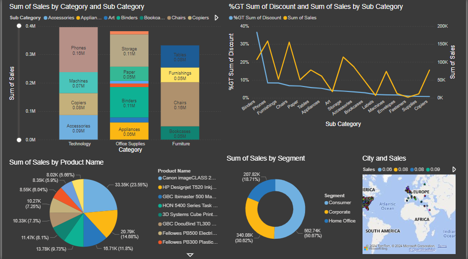

# Power BI Superstore Sales Analysis Report
This repository contains the source code, dataset and documentation for a Power BI report designed for retail sales analysis. The report provides valuable insights into sales performance, customer segmentation, and delivery efficiency for a superstore retail business.

## Overview
The Power BI report consists of a comprehensive analysis of sales data, including:

- Sales performance analysis
- Customer segmentation
- Delivery efficiency tracking

[View Full Report with Power BI](https://app.powerbi.com/groups/bdfeb1d6-d36b-4283-984d-a1833297d34f/reports/763658b4-b4bb-4d17-beff-f4461a5f165b/ReportSection?experience=power-bi)

## Conclusion
The project provides actionable insights to optimize business operations and enhance profitability. By analyzing sales performance, customer segmentation, and delivery efficiency, the project offers valuable strategic guidance for decision-making. With a comprehensive understanding of key metrics and trends, store managers can effectively allocate resources, tailor marketing strategies, and improve customer satisfaction. This project underscores the power of data-driven decision-making in driving business success in the retail industry.

## How to Use
1. Clone the repository to your local machine.
2. Open the Power BI project file (.pbix) using Power BI Desktop.
3. Navigate through the report pages to explore different analyses and visualizations.
4. Customize the report as per your requirements by modifying queries, adding new measures, or adjusting visualizations.

## Contributing
Contributions are welcome! If you find any issues or have suggestions for improvements, please open an issue or create a pull request.

## Credit
This is performed by [Prince Raj](https://www.linkedin.com/in/princeraj17/).
